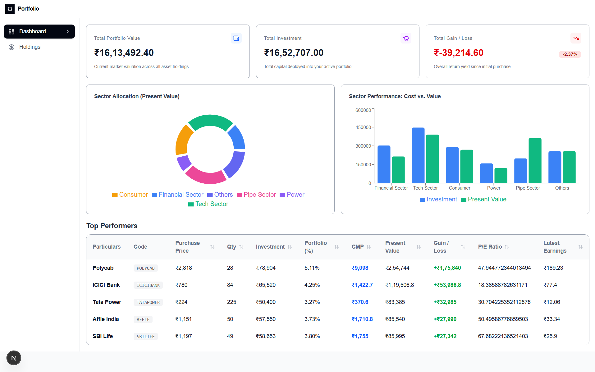
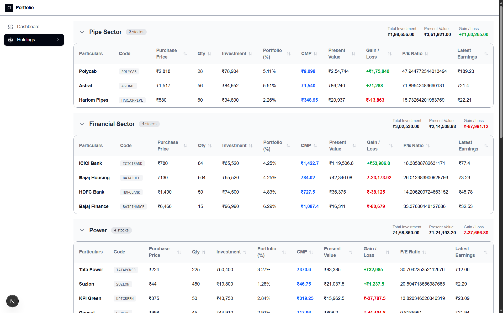

# 📈 Dynamic Stock Portfolio Dashboard

A web application designed to track stock portfolio metrics in real time. It aggregates live stock market prices from **Yahoo Finance** and fundamental financial valuation metrics (**P/E Ratio** and **Latest Earnings/EPS**)

---

## 🛠️ Tech Stack

### **Frontend**
* **Framework:** Next.js (App Router)
* **Language:** TypeScript
* **Styling:** Tailwind CSS
* **Table Engine:** TanStack Table (v8)
* **Icons:** Lucide React

### **Backend**
* **Runtime:** Node.js + Express.js
* **Language:** TypeScript
* **Scraping & Requests:** Axios, Cheerio
* **In-Memory Caching:** NodeCache

---

## 🚀 Key Features

* **Real-Time Market Data Aggregation:** Fetches live Current Market Prices (CMP) via Yahoo Finance and fundamental valuation metrics (P/E Ratio, EPS) from Google Finance.
* **Sector-Level Grouping:** Organizes holdings into distinct industry sectors (e.g., Financials, Tech, Power) with computed aggregate summaries for total cost, present value, and net gain/loss.
* **Interactive Table System:** Powered by TanStack React Table, offering multi-column sorting.
* **Automated Auto-Polling:** Dynamically updates market values.
* **Resilient Rate-Limit Throttling:** Processes Google Finance scraping requests in small batch chunks with timed delays to prevent HTTP 429 (Too Many Requests) blocks.
---

## 📸 Screenshots
Dashboard



Holdings




## ⚙️ Local Setup & Installation

### Prerequisites
* **Node.js:** v18.0.0 or higher
* **npm:** v9.0.0 or higher

---

### 1. Clone the Repository
```bash
git clone [https://github.com/your-username/portfolio-dashboard.git](https://github.com/your-username/portfolio-dashboard.git)
cd portfolio-dashboard
```


### 2. Backend Setup

```bash
cd backend

# Install dependencies
npm install

# Create environment file
echo "PORT=5000" > .env

# Run development server
npm run dev
```


### 2. Frontend Setup

```bash
cd frontend

# Install dependencies
npm install

# Create environment file
echo "NEXT_PUBLIC_API_URL=http://localhost:5000" > .env.local

# Run development server
npm run dev
```

